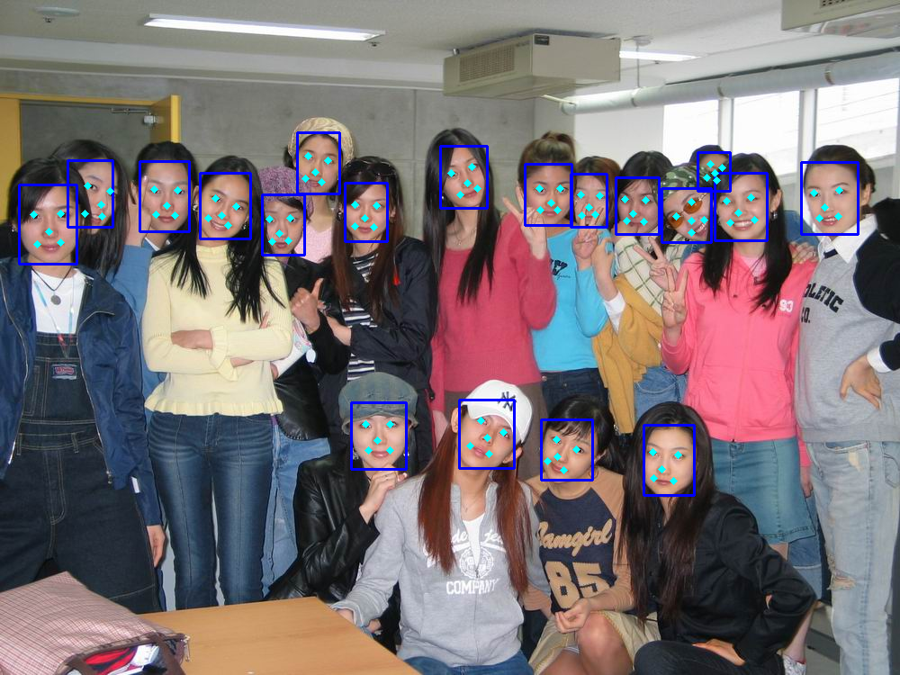

# MTCNN
[Joint Face Detection and Alignment using Multi-task Cascaded Convolutional Neural Networks](https://arxiv.org/abs/1604.02878v1)

## Environment
caffe windows 2103

## FCFacedet
检测的demo模块
main：FCFacedet_Tester.cpp
## FCFacedet_SDK
制作sdk模块
main ：FCFacedet.cpp
## FCFacedet_Tester
sdk测试模块
main：FCFacedet_Tester.cpp

## linux
    cd FCFacedet_Tester/FCFacedet_Tester
    make
    export LD_LIBRARY_PATH=./
    ./FCFacedetTester

## Results

